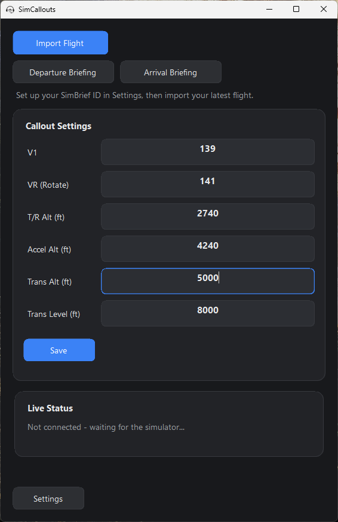
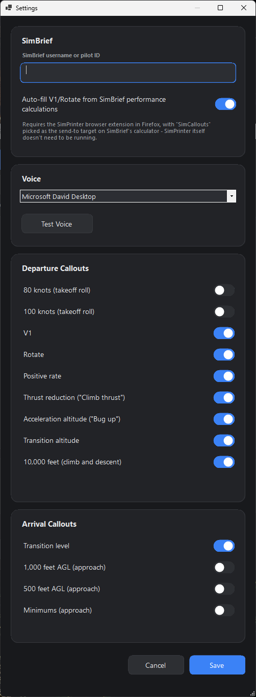
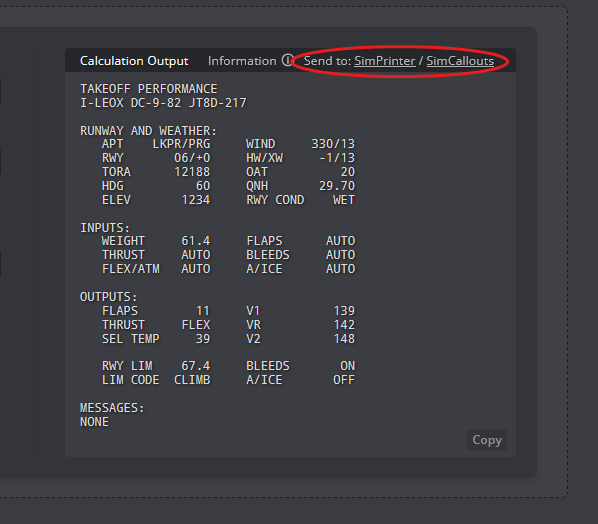

# SimCallouts

Speaks realistic takeoff and climb callouts - V1, Rotate, Positive rate, Climb thrust, Bug
up, 10,000 feet, and transition altitude/level - triggered automatically off live SimConnect
data, no button presses required. Every callout can be toggled on or off individually, so it
only speaks what you actually want to hear.

<p>
  
  
</p>

## What it does

Enter your V1, VR, thrust reduction altitude, and acceleration altitude yourself, or import
your latest SimBrief flight plan and let the [Firefox extension shared with
SimPrinter](#firefox-extension) auto-fill V1/Rotate straight from SimBrief's takeoff
performance calculator. Once a flight's loaded, hit **Departure Briefing** or **Arrival
Briefing** to have it read your planned runway, climb-out numbers, and transition data out
loud - like a real crew briefing before pushback.

SimConnect tracks airspeed, altitude, and ground state every second and calls things out the
moment each threshold is crossed: V1 and Rotate off airspeed, Positive rate off radio
altitude at liftoff, thrust reduction/acceleration/transition altitude off true MSL altitude,
and 10,000 feet as a fixed sterile-cockpit marker. Everything re-arms automatically once
you're back on the ground and slowed down, so it's ready for the next takeoff without any
manual reset.

Voice is whatever's installed on Windows (Settings -> Voice, with a Test Voice button) via
built-in SAPI text-to-speech - no API key, no internet connection required.

## Installing

`SimCallouts-x.y.z.msi` from [Releases](../../releases). Self-contained, nothing else to
install.

## Building it yourself

You'll need Windows 10/11 64-bit and either Visual Studio 2022 (Community's free, grab the
.NET desktop development workload) or just the .NET 8 SDK on its own. Open
`SimCallouts.slnx` and hit F5, or:

```
dotnet build -c Release
```

One thing worth knowing: `src/SimCallouts/lib/SimConnect/` has Microsoft's SimConnect client
vendored in (the managed DLL, the native one it calls into, and the VC++ redistributable that
native DLL needs) so the app can talk to the sim. These are Microsoft's files, not mine, and
they're not under this repo's MIT license - see the note at the bottom of
[LICENSE](LICENSE) if that matters to you. Same files ship with the free MSFS SDK if you'd
rather source them yourself.

## Using it

Open Settings, punch in your SimBrief username or pilot ID, and pick a voice. Back on the
main screen, set your V1/VR/altitudes manually (Save button) or use Import Flight to pull
them from SimBrief instead. Launch MSFS and the Live Status card shows "Connected to
simulator" once SimConnect links up - from there, callouts fire on their own as you fly.

Don't want to hear a particular callout? Turn it off in Settings -> Callouts - its input
field on the main screen disappears too, so you're not left staring at a box that does
nothing.

## Firefox extension

SimCallouts shares its SimBrief integration with the
[FlightTools Firefox extension](https://github.com/matsan000/Matsan000-s-Flighttools-firefox-extension),
also used by SimPrinter. Install that extension, open a Takeoff/Landing Performance
calculation on SimBrief, and pick
**SimCallouts** from the "Send to:" choice next to the result - V1 and Rotate get pulled out
and filled in automatically. This only needs the extension itself running in Firefox; unlike
printing, it doesn't require SimPrinter to also be open. Turn on "Auto-fill V1/Rotate from
SimBrief performance calculations" in SimCallouts's Settings first.

<p>
  
</p>

## Where things live

```
SimCallouts.slnx             Solution file - open this in Visual Studio
src/SimCallouts/
  SimCallouts.csproj          Project file
  Program.cs                  Entry point
  MainForm.cs / ConfigForm.cs UI
  UiStyle.cs                   Shared theming and custom-drawn controls
  SimConnectClient.cs          Polls SimConnect for airspeed, altitude, and ground state
  CalloutTracker.cs            Detects V-speed/altitude threshold crossings from live state
  BriefingBuilder.cs           Builds the spoken departure/arrival briefing text
  SimBriefClient.cs            Calls the SimBrief API
  SimBriefFlightPlan.cs        Flight plan data model + JSON parsing
  PerformanceCalcParser.cs     Extracts V1/VR out of SimBrief's raw performance-calc text
  LocalImportServer.cs         Localhost server the browser extension sends V1/VR through
  Preferences.cs               Settings persistence (%APPDATA%\SimCallouts)
  lib/SimConnect/               Vendored SimConnect client (see below)
installer/                    WiX installer source (build-installer.ps1 builds the MSI)
assets/                       Logo and other non-code assets
```

## License

MIT, see [LICENSE](LICENSE) - except the vendored SimConnect files under
`src/SimCallouts/lib/SimConnect/`, which are Microsoft's own redistributables.
